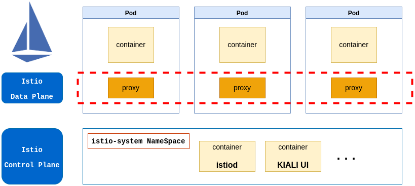

## Service Mesh

Istio is an open source implementation of a service mesh. A
service mesh is a relatively recent term used to describe a decentralized 
application networking infrastructure that allows applications to be secure, 
resilient, observable, and controllable. It describes an architecture made up 
of a data plane that uses application layer proxies to manage networking 
traffic on behalf of an application and a control plane to manage proxies.

The Istio project was started by teams from Google and IBM in partnership 
with the Envoy (the proxy) team from Lyft.

Istio is intended for microservices or service-oriented architecture (SOA)-style
architectures, but it is not limited to those.

## Not only microservices

Istio’s power shines as you move to architectures that experience large numbers 
of services, interconnections, and networks over unreliable cloud infrastructure.

Furthermore, since Istio runs out-of-process from the application, it can be 
deployed to existing legacy or brownfield environments as well, thus 
incorporating those into the mesh.

For example, if you have existing monolith deployments, the Istio service proxy 
can be deployed alongside each monolith instance and will transparently handle 
network traffic for it. At a minimum, this can add request metrics that become 
very useful for understanding the application’s usage, latency, throughput, and 
failure characteristics. Istio can also participate in higher-level features 
like policy enforcement about what services are allowed to talk to it.

## Architecture overview



Istio is an implementation of a service mesh with a Data Plane based on Envoy 
(proxy in the picture) and a Control Plane (istio-system namespace in the picture).

**The data plane**, which is composed of service proxies that are deployed
alongside applications and complement them by implementing policies, managing traffic, 
generating metrics and traces, and much more. Istio uses Envoy as its service 
proxy due to its versatility and because it can be dynamically configured.

**The control plane**, which exposes an API for operators to manipulate the
data plane’s network behavior.

## Installation

### Istioclt download


**Option 1**

Download istioctl from the [Istio release page](https://github.com/istio/istio/releases).

```
tar xvzf istioctl-1.15.3-linux-amd64.tar.gz
```

**Option 2**

```
curl -L https://istio.io/downloadIstio | ISTIO_VERSION=1.13.0 sh -
```

```
istio-1.13.0/bin/istioctl version --remote=false
```
In order to use the command regularly you have to configure KUBECONFIG variable 
so “istioctl” can communicate with the Kubernetes cluster.

This is a basic (the minimal) installation of Istio, the UI, Grafana and other 
components have to be installed manually.


### Configuration Profiles

Installation using [Configuration Profiles](https://istio.io/latest/docs/setup/additional-setup/config-profiles/).

The built-in configuration profiles that can be used when installing Istio. The 
profiles provide customization of the Istio control plane and of the sidecars 
for the Istio data plane.

You can start with one of Istio’s built-in configuration profiles and then 
further customize the configuration for your specific needs. The following built-in 
configuration profiles are currently available:

* **default**: This is the same as “istioctl install”. This profile is recommended for production deployments 
and for primary clusters.
* **demo**: This profile enables high levels of tracing and access logging so it is not suitable for performance tests.
This profile is recommend for testing the platform itself, selt-training and study.
* **minimal**: same as the default profile, but only the control plane components are installed. 
This allows you to configure the control plane and data plane components (e.g., gateways) using separate profiles.

There are other profiles, such as **external**, **empty**, **preview** and so on.

```
istioctl profile list
istioctl install --set profile=default
istioctl install --set profile=demo
```
We can change from one profile to another, the istioctl command will remove the unnecessary 
components (or will add) from one profile to the other.

### Profile customization

```
istioctl profile dump demo > demo_settings.yaml
(custom mofifications here)
istioctl install -f demo_settings.yaml
```

You can not use the standard kubectl (because this yaml doesn’t have the CRD definitions).

The way of creating a full yaml files for deploying istio is:

```
istioctl profile dump demo > demo_settings.yaml
(custom mofifications here)
istioctl manifest generate -f demo_settings.yaml > all_istio_manifests.yaml
kubectl apply -f all_istio_manifests.yaml
```

*NOTE*: Anyway you will have problems using kubectl, one of them is you have to create 
the istio-system NameSpace (is not included in the yaml), and you have to create the CRD 
before creating the objects, so you will get errors.

## Istio Integrations

You can extend Istio with other tools, a list a components for adding extra functionality
to Istio is listed [here](https://istio.io/latest/docs/ops/integrations/).

An example of providing additional functionality (add Kiali Istio UI):

```
kubectl apply -f https://raw.githubusercontent.com/istio/istio/release-1.15/samples/addons/kiali.yaml
```

## Enabling Sidecar Injection (Proxies)

The activation of proxy injections (sidecar inside our applications pod automatically) is 
labeling the NameSpaces. For example in order to enable proxy injection in the “default” namespace:

```
kubectl describe ns default

Name:         default
Labels:       kubernetes.io/metadata.name=default
Annotations:  <none>
Status:       Active
No resource quota.
No LimitRange resource.
```

```
kubectl label ns default istio-injection=enabled
kubectl describe ns default

Name:         default
Labels:       kubernetes.io/metadata.name=default
              istio-injection=enabled
Annotations:  <none>
Status:       Active
No resource quota.
No LimitRange resource.
```


