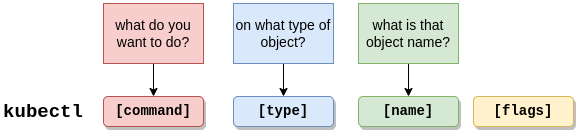

## Generic

| ```kubectl cluster-info``` |
| ```kubectl version```      |
| ```kubectl version --client```      |
| ```kubectl plugin list```      |
| ```kubectl krew list```      |
| ```kubectl api-resources```      |
| ```kubectl api-resources --namespaced=true```      |
| ```kubectl api-resources --namespaced=false```      |
| ```kubectl describe clusterrole cluster-admin```      |
| ```kubectl get all (-n namespace, -A, --all-namespaces)```      |

## Namespaces

| ```kubectl get namespaces (ns)``` |
| ```kubectl get ns -o json | jq .``` |
| ```kubectl create namespace my-ns-name``` |

## Nodes

| ```kubectl get nodes``` |
| ```kubectl get nodes -o wide``` |
| ```kubectl describe nodes``` |

## Pods

| ```kubectl get pods``` |
| ```kubectl get pods -w``` |
| ```kubectl get pods --show-labels``` |
| ```kubectl get pods --all-namespaces (-A)``` |
| ```kubectl get pods --all-namespaces --show-labels``` |
| ```kubectl get pods --all-namespaces --show-labels --no-headers | wc -l``` |
| ```kubectl get pods --selector App=app1 (k get pods -l App=app1)``` |
| ```kubectl delete pod my-pod-name``` |
| ```kubectl describe pod my-pod-name``` |
| ```kubectl run nginx --image=nginx``` |
| ```kubectl run nginx --image=nginx --namespace=dev``` |
| ```kubectl run test --image=busybox --command -- sleep infinity``` |
| ```kubectl exec nginx -ti -- bash``` |
| ```kubectl exec etcd-k8s-master.kubernetes.lan -n kube-system -- etcdctl version``` |
| ```kubectl run nginx --image=nginx --dry-run=client -o yaml``` |

## ReplicationController

| ```kubectl get replicationcontrollers (rc)``` |
| ```kubectl get rc -n kube-public``` |
| ```kubectl get rc -n all``` |

## ReplicaSet

| ```kubectl get replicaset (rs)``` |
| ```kubectl delete rs rs-name``` |
| ```kubectl scale --replicas=6 rs rs-name``` |
| ```kubectl scale --replicas=6 -f rs-definition.yaml``` |

## Deployment

| ```kubectl get deployments (deploy)``` |
| ```kubectl get deploy myapp-deployment -o yaml (or -o json)``` |
| ```kubectl rollout status deploy/myapp-deployment``` |
| ```kubectl rollout history deploy/myapp-deployment``` |
| ```kubectl rollout undo deploy/myapp-deployment``` |
| ```kubectl create deployment --image=nginx nginx --dry-run=client -o yaml``` |
| ```kubectl create deployment --image=nginx nginx --replicas=4 --dry-run=client -o yaml``` |
| ```kubectl create deployment nginx --image=nginx --replicas=4``` |
| ```kubectl scale deployment nginx --replicas=5``` |
| ```kubectl apply view-last-applied deploy myapp-deployment``` |
| ```kubectl rollout restart sts kudu-master -n apache-kudu-ns``` |

## Service

| ```kubectl get services (svc)``` |
| ```kubectl get svc -o wide```|
| ```kubectl create service clusterip redis --tcp=6379:6379 --dry-run=client -o yam```|
| ```kubectl expose pod redis --port=6379 --name redis-service --dry-run=client -o yaml``` |
| ```kubectl expose pod nginx --type=NodePort --port=80 --name=nginx-service --dry-run=client -o yaml```|
| ```kubectl create service nodeport nginx --tcp=80:80 --node-port=30080 --dry-run=client -o yaml```|

## Config

| ```kubectl config view```|
| ```kubectl config current-context```|
| ```kubectl config get-contexts```|
| ```kubectl config set-context --current --namespace=kube-system```|

## Quota

| ```kubectl get quota --namespace=myspace```|
| ```kubectl create quota test --hard=count/deployments.apps=2,count/replicasets.apps=4,count/pods=3,count/secrets=4 --namespace=myspace```|
| ```kubectl describe quota my-quota --namespace=myspace```|

## Taint

| ```kubectl taint node node01 color=blue:NoSchedule```|
| ```kubectl describe node node01 | grep Taints```|
| ```kubectl explain pod --recursive | grep -A5 tolerations```|

## DaemonSet

| ```kubectl get daemonsets```|

## ConfigMap

| ```kubectl get configmaps (cm)```|
| ```kubectl describe configmaps my-configurations```|
| ```kubectl create configmap my-configrations --from-literal=VAR1=VAL1```|
| ```kubectl create configmap --from-file=my-configurations.properties```|

## PersistenVolume

| ```kubectl get persistentvolumes (k get pv)```|
| ```kubectl describe pv pv001```|
| ```kubectl get pv pv001```|
| ```kubectl get pv pv001 -o yaml > pv001.yaml```|
| ```kubectl get pvc```|

## Misc

| ```kubectl run test --image=k8s.gcr.io/e2e-test-images/jessie-dnsutils:1.3 --command -- sleep infinity```|
| ```kubectl exec -ti test -- host kubernetes.default```|
| ```kubectl exec -ti test -- cat /etc/resolv.conf ```|
| ```kubectl get svc --namespace=kube-system```|
| ```kubectl port-forward nginx-test 8080:80 --address="0.0.0.0"```|


