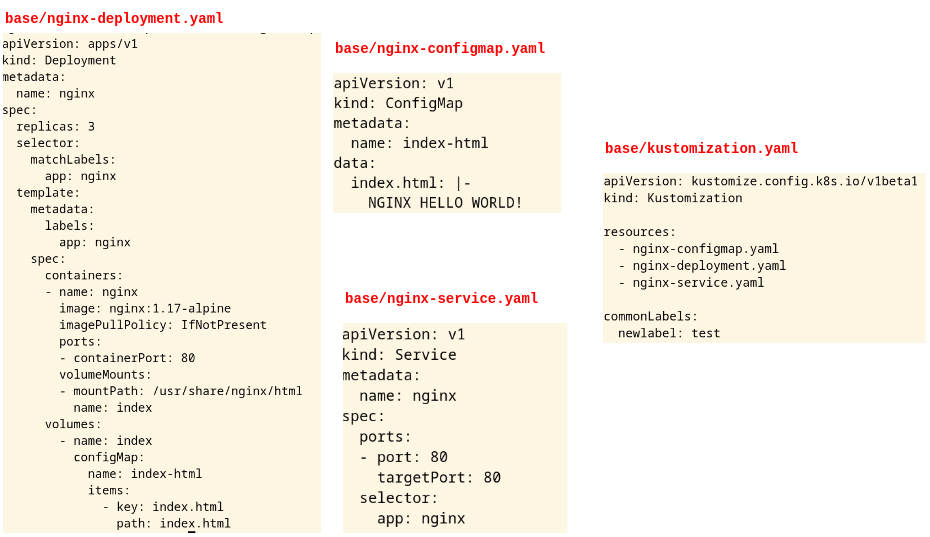
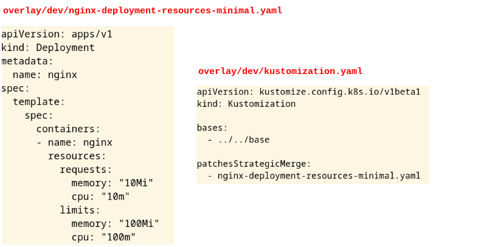
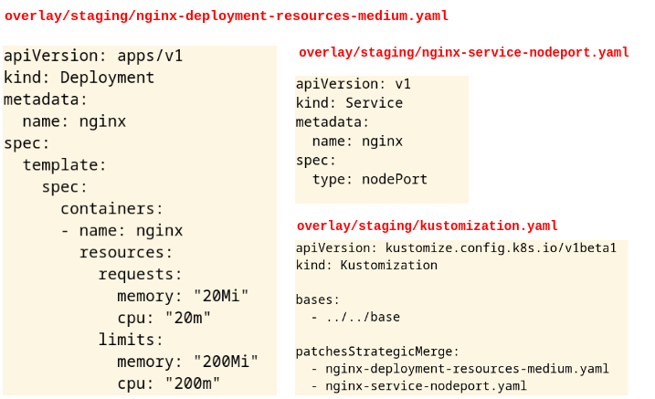
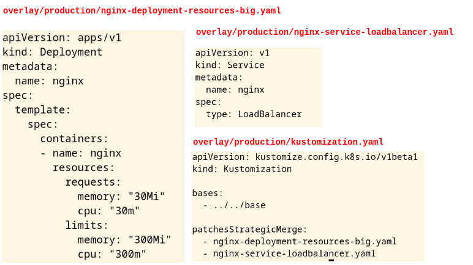

## Introduction

Kustomize is a tool used to customize Kubernetes objects (YAMLs) in a template-free way. 
kustomize emphasizes that it is not a template system, as opposed to the well-known HELM tool.
Often HELM is known as a *Template Engine* and Kustomize is named or known as a *Overlay Engine*.

Kustomize works over the original Kubernetes YAMLs (without touching them), and HELM 
works over templates (Charts) for creating the final Kubernetes YAMLs.

So Kustomize is a configuration management solution that leverages layering to 
preserve the base settings of your applications and components by overlaying 
declarative yaml artifacts (called patches) that selectively override default 
settings without actually changing the original files. 

We can use Kustomize in two ways: use the standalone version of Kustomize or use 
kubectl. Kustomize is a part of Kubectl since version 1.14.

```
kustomize version
{Version:kustomize/v4.5.7 GitCommit:56d82a8 GoOs:linux GoArch:amd64}
``` 

## Installation

Installing an standalone binary:

```
curl -s "https://raw.githubusercontent.com/kubernetes-sigs/kustomize/master/hack/install_kustomize.sh"  | bash
```

## kustomization.yaml

The tool’s behavior is determined by declarative specifications expressed in a 
file called ```kustomization.yaml```.

The kustomize program reads the file and the Kubernetes API resource files it 
references, then emits complete resources to standard output. This text output 
can be further processed by other tools, or streamed directly to kubectl for 
application to a cluster.

## Some simple examples

Let's see a typical deployment of NGINX with a ConfigMap and a Service:

The ```configmap.yaml``` file:

```
apiVersion: v1
kind: ConfigMap
metadata:
  name: index-html
data:
  index.html: |-
    NGINX HELLO WORLD!
```

The ```nginx-deployment.yaml``` file:

```
apiVersion: apps/v1
kind: Deployment
metadata:
  name: nginx
spec:
  replicas: 3
  selector:
    matchLabels:
      app: nginx
  template:
    metadata:
      labels:
        app: nginx
    spec:
      containers:
      - name: nginx
        image: nginx:1.17-alpine
        imagePullPolicy: IfNotPresent        
        ports:
        - containerPort: 80
        resources:
          requests:
            memory: "64Mi"
            cpu: "200m"
          limits:
            memory: "128Mi"
            cpu: "500m"
        volumeMounts:
        - mountPath: /usr/share/nginx/html
          name: index
      volumes:
        - name: index
          configMap:
            name: index-html
            items:
              - key: index.html
                path: index.html
```


The ```nginx-service-nodeport.yaml``` file:

```
apiVersion: v1
kind: Service
metadata:
  name: nginx
spec:
  type: NodePort
  ports:
  - port: 80
    targetPort: 80
    nodePort: 30000
  selector:
    app: nginx
```


We have the following folder structure:

```
application/
├── configmap.yaml
├── nginx-deployment.yaml
└── nginx-service-nodeport.yaml
```

We can use as usual the standard ```kubectl``` command:

```
kubectl apply -f application/configmap.yaml
kubectl apply -f application/nginx-deployment.yaml
kubectl apply -f application/nginx-service-nodeport.yaml
```

To do the same using kustomize tool we have to add the following
configuration file:

```
application/
├── configmap.yaml
├── kustomization.yaml
├── nginx-deployment.yaml
└── nginx-service-nodeport.yaml
```

The ```kustomization.yaml ``` file:

```
apiVersion: kustomize.config.k8s.io/v1beta1
kind: Kustomization

resources:
  - nginx-deployment.yaml
  - nginx-service-nodeport.yaml
  - configmap.yaml
```

We can use kustomize for appling the manifests. The following command componse 
a single-yaml to the standard output, and only do that.

```
kustomize build application
or
cd appliaction && kustomize build .
```

For applaying the single-yaml on the flay we have to pipe the output with the regular kubectl command as follows:

```
kustomize build application | kubectl apply -f -
```

At this point we are not doing anything relevant at all, we are not using the 
power of kustomize tool. Let's see a small feature for understanding what we can do.

The fields in a kustomization file allow the user to specify which resource files 
to use as input, how to generate new resources, and how to transform those 
resources - add labels, patch them, etc. 
[A Kustomize feature list](https://kubernetes.io/docs/tasks/manage-kubernetes-objects/kustomization/#kustomize-feature-list)

### Example 1

For example we are going to add label to our manifests:

```kustomization.yaml ```

```
apiVersion: kustomize.config.k8s.io/v1beta1
kind: Kustomization

resources:
  - nginx-deployment.yaml
  - nginx-service-nodeport.yaml
  - configmap.yaml

commonLabels:
  newlabel: test
```

```
kustomize build application | kubectl delete -f -
kustomize build application | kubectl apply -f -
k get all,cm --show-labels | grep newlabel

pod/nginx-789f78d84c-5cvfw   1/1     Running   0             31s   app=nginx,newlabel=test,pod-template-hash=789f78d84c
pod/nginx-789f78d84c-5d9ws   1/1     Running   0             31s   app=nginx,newlabel=test,pod-template-hash=789f78d84c
pod/nginx-789f78d84c-gjtcj   1/1     Running   0             31s   app=nginx,newlabel=test,pod-template-hash=789f78d84c
service/nginx  NodePort  10.111.38.182  <none>  80:30000/TCP 31s   newlabel=test
deployment.apps/nginx    3/3     3            3              31s   newlabel=test
replicaset.apps/nginx-789f78d84c   3         3         3     31s   app=nginx,newlabel=test,pod-template-hash=789f78d84c
configmap/index-html                                1        34s   newlabel=test
```

### Example 2

Kustomize provides two ways of adding ConfigMap in one kustomization, either by declaring ConfigMap 
as a resource or declaring ConfigMap from a ConfigMapGenerator. In the above example we are using
the first one, adding a ConfigMap as resource (the resource is listed in the *resources:* section).

Now we are going to used the ConfigMapGenerator of Kustomize. With this feature we are giving 
the capability of creating the ConfigMap to Kustomize automatically. The ConfigMap declared from a 
ConfigMapGenerator is treated differently. A hash is appended to the name and any change in 
the ConfigMap will trigger a rolling update.

```kustomization.yaml ```

```
apiVersion: kustomize.config.k8s.io/v1beta1
kind: Kustomization

resources:
  - nginx-deployment.yaml
  - nginx-service-nodeport.yaml
  - # configmap.yaml # removing the ConfigMap as resource

configMapGenerator:
- name: index-html
  files:
  - index.html
```
In this case we have to add to our folder the index.html file:

```
application/
├── configmap.yaml
├── kustomization.yaml
├── index.html
├── nginx-deployment.yaml
└── nginx-service-nodeport.yaml
```

The ```index.html``` file:

```
NGINX HELLO WORLD generated by kustomize!
```

```
k delete cm index-html
kustomize build application | kubectl apply -f -
k get cm

NAME                    DATA   AGE
index-html-7m8259fckk   1      46s

curl 192.168.5.2:30000
NGINX HELLO WORLD generated by kustomize!
```

If we change the file ```index.html``` file:

```
NGINX HELLO WORLD generated by kustomize with a change!
```

```
kustomize build application | kubectl apply -f -
k get cm

NAME                    DATA   AGE
index-html-7m8259fckk   1      3m6s
index-html-kbkmd84mtf   1      7s

curl 192.168.5.2:30000
NGINX HELLO WORLD generated by kustomize with a change!
```

This procedure help us to carry out best practises:
Changing the data held by a live ConfigMap in a cluster is considered bad practice. 
Deployments have no means to know that the ConfigMaps they refer to have changed, 
so such updates have no effect.

The recommended way to change a deployment's configuration is to

1. create a new ConfigMap with a new name,
2. patch the deployment, modifying the name value of the appropriate configMapKeyRef field.

This latter change initiates rolling update to the pods in the deployment. The older ConfigMap, 
when no longer referenced by any other resource, is eventually garbage collected.

## Bases and overlays

Kustomize has the concepts of bases and overlays. 

A base is a directory with a kustomization.yaml, which contains a set of resources 
and associated customization. A base could be either a local directory or a 
directory from a remote repo, as long as a kustomization.yaml is present inside. 

An overlay is a directory with a kustomization.yaml that refers to other kustomization 
directories as its bases. 

A base has no knowledge of an overlay and can be used in multiple overlays. 
An overlay may have multiple bases and it composes all resources from bases and 
may also have customization on top of them.

In other words:

1. Base Layer (bases): Specifies the most common resources.
2. Patch Layers (overlays): Specifies use case specific resources.

## Complete example

Let’s step through how Kustomize works using a deployment scenario involving 3 
different environments: dev, staging, and production.

All of the environments will use different types of services for exposing an 
NGINX deployment and different resources:

* Dev: ClusterIP, minimal resources.
* Staging: NodePort, medium resources.
* Production: LoadBalancer, big resources.

Kustomize project folder structure proposal:

```
example/
├── base
│   ├── kustomization.yaml
│   ├── nginx-configmap.yaml
│   ├── nginx-deployment.yaml                       <== Base Deployment
│   └── nginx-service.yaml                          <== Base Service
└── overlay
    ├── dev
    │   ├── kustomization.yaml
    │   └── nginx-deployment-resources-minimal.yaml <== Patch Base Deployment
    ├── production
    │   ├── kustomization.yaml
    │   ├── nginx-service-loadbalancer.yaml         <== Patch Base Service
    │   └── nginx-deployment-resources-big.yaml     <== Patch Base Deployment
    └── staging
        ├── kustomization.yaml
        ├── nginx-service-nodeport.yaml             <== Patch Base Service
        └── nginx-deployment-resources-medium.yaml  <== Patch Base Deployment
```

So in this example we are going to patch the base Deployment (with different 
resources) and the base Service (with different service discovery).

### The base layer



### The overlay for development



### The overlay for stagging



### The overlay for production



Building of the manifest:

```
kustomize build overlay/dev
kustomize build overlay/staging/
kustomize build overlay/production/
```


