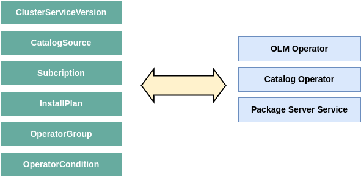
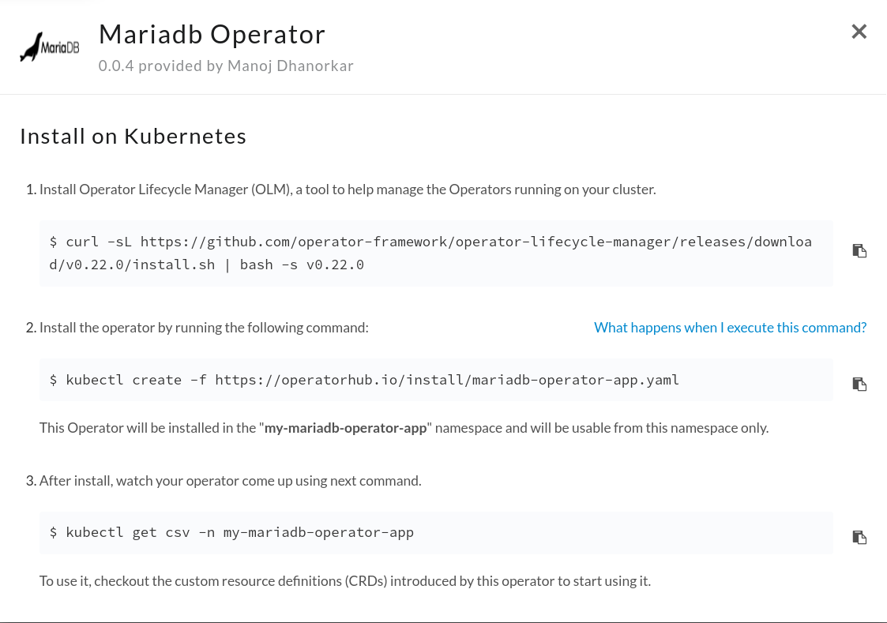
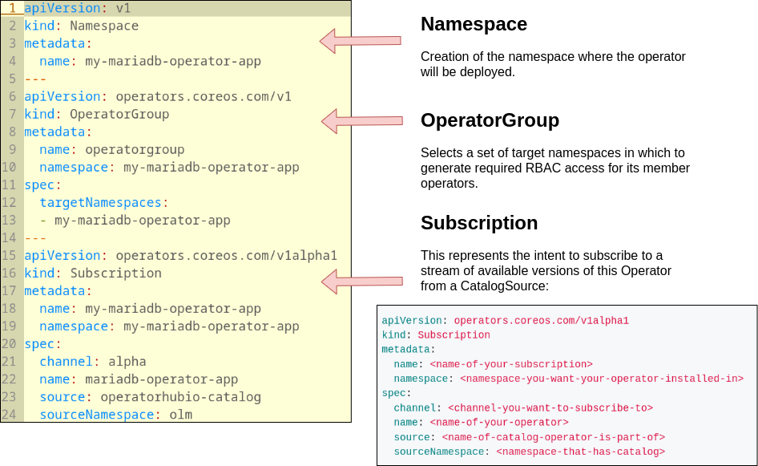
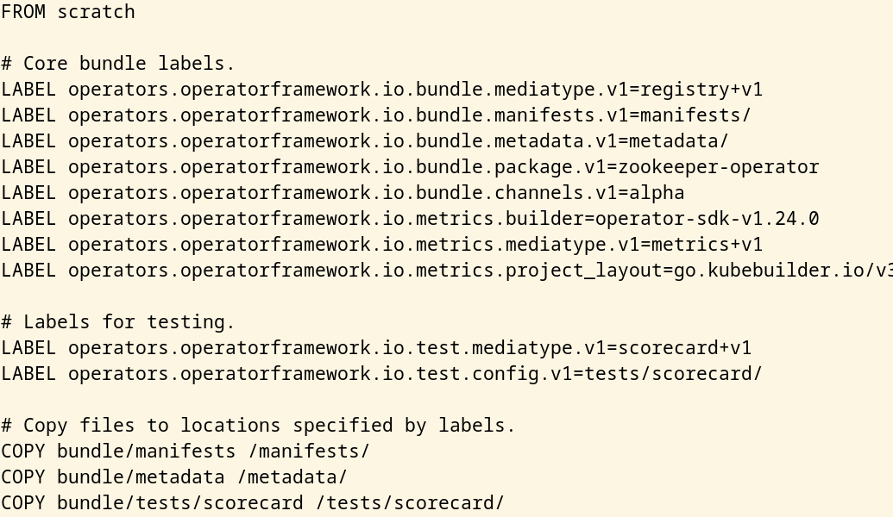
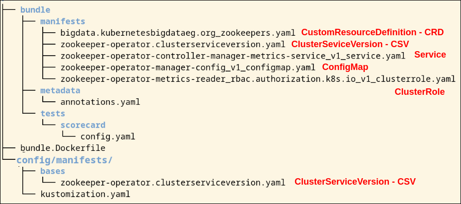

## Introduction

There are multiple steps involved in deploying an Operator, including creating 
the deployment, adding the custom resource definitions, and configuring the 
necessary permissions, a management layer becomes necessary to facilitate the 
process.

Operator Lifecycle Manager (OLM) fulfills this role by introducing a packaging
mechanism for delivering Operators. So OLM is incharge of installing, packaging
and mananging Operators.

Conceptually a specific tool for operator packaging may a priori conflict with 
the standard HELM kubernetes application packaging tool. The recommendation by 
the creators of OLM is the following dissertation:

If the workload does not require any Day-2 operation beyond simple update/replace 
Kubernetes operations and resources are never manipulated manually, Helm is a great 
choice. There are a lot of charts available in the community that make it easy to 
get started, especially in test beds or development environments.

For everything else, Operators provide more application-aware logic for Day-2 
operations that are especially important for production environments. Examples 
range from coordinated updates without downtime over to regularly running backup 
and even restore.


## Overview of the OLM

OLM standardizes interactions with operators by requiring that the interface to an operator 
be via the Kubernetes API. Because we expect users to define the interfaces to their applications, 
OLM currently uses CRDs to define the Kubernetes API interactions. The Operator Lifecycle Manager 
is composed of two Operators: the OLM Operator and the Catalog Operator.

* The **OLM Operator** watches for CSVs (next section) to appear in namespaces it's watching. Watches all namespaces
by default. Checks that all requierd CRDs specified in the CSV are available in the cluster, and deploys the target Operator
as specified bye the CSV if all required resources are available.

* The **Catalog Operator** is responsible for resolving and installing CSVs and the required resources they specify. 
It is also responsible for watching CatalogSources for updates to packages in channels (by means of subscriptions) 
and upgrading them (optionally automatically) to the latest available versions. Creates InstallPlans to build out
required resources for new and upgraded CSVs.

Those operators are deployed using a standard kubernetes Deployment, along with a third Deployment (not an operator)
know as PackageServer:

* The **PackageServer** is a deployment that shows all packages avaiable to install across Catalogs.

To get a list of all of them deployments:

```
$ k get deploy -n olm
NAME               READY   UP-TO-DATE   AVAILABLE   AGE
catalog-operator   1/1     1            1           2d2h
olm-operator       1/1     1            1           2d2h
packageserver      2/2     2            2           2d2h
```

Each of these Operators are responsible for managing the CRDs that are the basis for the OLM framework.
The following is a list of CRDs managed by OLM and Catalog Operators

<p>

</p>


| ResourceShort   | name          | Description       |
|-----------------|---------------|-------------------|
|ClusterServiceVersion (CSV)| csv    | Application metadata. For example: name, version, icon, required resources|
|CatalogSource              | catsrc | A repository of CSVs, CRDs, and packages that define an application|
|Subscription               | sub    | Keeps CSVs up to date by tracking a channel in a package|
|InstallPlan                | ip     | Calculated list of resources to be created to automatically install or upgrade a CSV|
|OperatorGroup              | og     | Configures all Operators deployed in the same namespace as the OperatorGroup object to watch for their custom resource (CR) in a list of namespaces or cluster-wide|
|OperatorConditions         | -      | Creates a communication channel between OLM and an Operator it manages. Operators can write to the Status.Conditions array to communicate complex states to OLM|

**Note**: You can get CRDs full list with the following command:
```
$ k api-resources | grep -i operators.coreos
catalogsources                    catsrc              operators.coreos.com/v1alpha1              true         CatalogSource
clusterserviceversions            csv,csvs            operators.coreos.com/v1alpha1              true         ClusterServiceVersion
installplans                      ip                  operators.coreos.com/v1alpha1              true         InstallPlan
olmconfigs                                            operators.coreos.com/v1                    false        OLMConfig
operatorconditions                condition           operators.coreos.com/v2                    true         OperatorCondition
operatorgroups                    og                  operators.coreos.com/v1                    true         OperatorGroup
operators                                             operators.coreos.com/v1                    false        Operator
subscriptions                     sub,subs            operators.coreos.com/v1alpha1              true         Subscription
packagemanifests                                      packages.operators.coreos.com/v1           true         PackageManifest
```


The **ClusterServiceVersion (CSV)** is the primary metadata resource that describes an
Operator. Each CSV represents a version of an Operator and contains the following:

* General metadata about the Operator, including its name, version, description,
and icon
* Operator installation information, describing the deployments that are created
and the permissions that are required
* The CRDs that are owned by the Operator as well as references to any CRDs the
Operator is dependent on
* Annotations on the CRD fields to provide hints to users on how to properly
specify values for the fields

When learning about CSVs, it can be useful to relate the concepts to that of a traditional 
Linux system. You can think of a CSV as analogous to a Linux package, such as
a Red Hat Package Manager (RPM) file. Like an RPM file, the CSV contains information 
on how to install the Operator and any dependencies it requires. Following this
analogy, you can think of OLM itself as a management tool similar to yum or DNF.

ClusterServiceVersion summary:

- YAML manifest for an Operator
- Packaging an application for OLM (such as rpm, apk, deb)
- Operator metadata (name, description, version, icon, ...)
- CRDs (owned by this Operator, required to be in the cluster for this Operator start)
- Install strategy (Operator deployment details, service accounts details, and permissions)

A **CatalogSource** contains information for accessing a repository of Operators.
OLM provides a utility API named packagemanifests (it's an operator, remember
an operator is an extension of k8s standard API) for querying catalog sources, which
provides a list of Operators and the catalogs in which they are found. It uses resources
of this kind to populate the list of available Operators. A catalog source 
represents a store of metadata, typically by referencing an index image stored 
in a container registry. Operator Lifecycle Manager (OLM) queries catalog sources 
to discover and install Operators and their dependencies. 

A subscription, defined by a **Subscription** object, represents an intention to 
install an Operator. It is the custom resource that relates an Operator to a catalog source.
End users create a subscription to install, and subsequently update, the Operators that
OLM provides. A subscription is made to a channel, which is a stream of Operator
versions, such as “stable” or “nightly.” Subscriptions describe which channel 
of an Operator package to subscribe to, and whether to perform updates automatically 
or manually. If set to automatic, the subscription ensures Operator Lifecycle 
Manager (OLM) manages and upgrades the Operator to ensure that the latest 
version is always running in the cluster.

The Subscription object defines the name and namespace of the Operator, as well 
as the catalog from which the Operator data can be found. The channel, such as 
alpha, beta, or stable, helps determine which Operator stream should be installed 
from the catalog source. The names of channels in a subscription can differ 
between Operators, but the naming scheme should follow a common convention within 
a given Operator. For example, channel names might follow a minor release update 
stream for the application provided by the Operator (1.2, 1.3) or a release 
frequency (stable, fast).

A subscription creates an **InstallPlan**, which describes the full list of resources that
OLM will create to satisfy the CSV’s resource requirements. To install an Operator, 
a cluster administrator, or a user who has been granted Operator installation 
permissions, must first create a Subscription object. A subscription represents 
the intent to subscribe to a stream of available versions of an Operator from a 
catalog source. The subscription then creates an InstallPlan object to facilitate 
the installation of the resources for the Operator.

The install plan must then be approved according to one of the following 
approval strategies (aka. approval mode):

* If the subscription’s spec.installPlanApproval field is set to Automatic, 
the install plan is approved automatically.

* If the subscription’s spec.installPlanApproval field is set to Manual, 
the install plan must be manually approved by a cluster administrator or user 
with proper permissions.

After the install plan is approved, OLM creates the specified resources and 
installs the Operator in the namespace that is specified by the subscription.

An **Operator group**, defined by the OperatorGroup resource, provides multitenant 
configuration to OLM-installed Operators. An Operator group selects target 
namespaces in which to generate required RBAC access for its member Operators.
In other words, end users control Operator multitenancy through an OperatorGroup. 
These designate namespaces that may be accessed by an individual Operator, so an
Operator belonging to an OperatorGroup will not react to custom resource changes
in a namespace not indicated by the group.

Although you can use OperatorGroups for fine-grained control for a set of namespa‐
ces, they are most commonly used in two ways:

* To scope an Operator to a single namespace
* To allow an Operator to run globally across all namespaces

The set of target namespaces is provided by a comma-delimited string stored in 
the olm.targetNamespaces annotation of a cluster service version (CSV). 
This annotation is applied to the CSV instances of member Operators and is 
projected into their deployments.

**Operator conditions**, OLM provides a custom resource definition (CRD) called 
OperatorCondition that allows Operators to communicate conditions to OLM. There 
are a set of supported conditions that influence management of the Operator by 
OLM when present in the Spec.Conditions array of an OperatorCondition resource.

## Installing OLM

### Installing with operator-sdk cli

The ```operator-sdk``` binary provides a command to easily install and uninstall 
OLM in a Kubernetes cluster.

```
$ operator-sdk olm install 
INFO[0000] Fetching CRDs for version "latest"                                                                                                                                                                      
INFO[0000] Fetching resources for resolved version "latest"                                                                                                                                                        
I1215 11:07:50.351439    8034 request.go:601] Waited for 1.046217131s due to client-side throttling, not priority and fairness, request: GET:https://k8s-master.kubernetes.lan:6443/apis/apps/v1?timeout=32s       
INFO[0010] Creating CRDs and resources                                                                                                                                                                             
INFO[0010]   Creating CustomResourceDefinition "catalogsources.operators.coreos.com"                                                                                                                               
INFO[0010]   Creating CustomResourceDefinition "clusterserviceversions.operators.coreos.com"                                                                                                                       
INFO[0010]   Creating CustomResourceDefinition "installplans.operators.coreos.com"                                                                                                                                 
INFO[0010]   Creating CustomResourceDefinition "olmconfigs.operators.coreos.com"                                                                                                                                   
INFO[0010]   Creating CustomResourceDefinition "operatorconditions.operators.coreos.com"                                                                                                                           
INFO[0010]   Creating CustomResourceDefinition "operatorgroups.operators.coreos.com"                                                                                                                               
INFO[0010]   Creating CustomResourceDefinition "operators.operators.coreos.com"                                                                                                                                    
INFO[0010]   Creating CustomResourceDefinition "subscriptions.operators.coreos.com"                                                                                                                                
INFO[0010]   Creating Namespace "olm"                                                                                                                                                                              
INFO[0010]   Creating Namespace "operators"                                                                                                                                                                        
INFO[0011]   Creating ServiceAccount "olm/olm-operator-serviceaccount"                                                                                                                                             
INFO[0011]   Creating ClusterRole "system:controller:operator-lifecycle-manager"                                                                                                                                   
INFO[0011]   Creating ClusterRoleBinding "olm-operator-binding-olm"                                                                                                                                                
INFO[0011]   Creating OLMConfig "cluster"                                                                
INFO[0012]   Creating Deployment "olm/olm-operator"                                                      
INFO[0012]   Creating Deployment "olm/catalog-operator"                                                  
INFO[0012]   Creating ClusterRole "aggregate-olm-edit"                                                   
INFO[0012]   Creating ClusterRole "aggregate-olm-view"                                                   
INFO[0012]   Creating OperatorGroup "operators/global-operators"                                         
INFO[0014]   Creating OperatorGroup "olm/olm-operators"                                                  
INFO[0014]   Creating ClusterServiceVersion "olm/packageserver"                                          
INFO[0014]   Creating CatalogSource "olm/operatorhubio-catalog"                                          
INFO[0014] Waiting for deployment/olm-operator rollout to complete                                       
INFO[0014]   Waiting for Deployment "olm/olm-operator" to rollout: 0 of 1 updated replicas are available                                                                                                           
INFO[0025]   Deployment "olm/olm-operator" successfully rolled out 
INFO[0025] Waiting for deployment/catalog-operator rollout to complete 
INFO[0025]   Waiting for Deployment "olm/catalog-operator" to rollout: 0 of 1 updated replicas are available 
INFO[0027]   Deployment "olm/catalog-operator" successfully rolled out 
INFO[0027] Waiting for deployment/packageserver rollout to complete 
INFO[0027]   Waiting for Deployment "olm/packageserver" to rollout: 0 of 2 updated replicas are available  
INFO[0041]   Deployment "olm/packageserver" successfully rolled out 
INFO[0041] Successfully installed OLM version "latest" 

NAME                                            NAMESPACE    KIND                        STATUS
catalogsources.operators.coreos.com                          CustomResourceDefinition    Installed
clusterserviceversions.operators.coreos.com                  CustomResourceDefinition    Installed
installplans.operators.coreos.com                            CustomResourceDefinition    Installed
olmconfigs.operators.coreos.com                              CustomResourceDefinition    Installed
operatorconditions.operators.coreos.com                      CustomResourceDefinition    Installed
operatorgroups.operators.coreos.com                          CustomResourceDefinition    Installed
operators.operators.coreos.com                               CustomResourceDefinition    Installed
subscriptions.operators.coreos.com                           CustomResourceDefinition    Installed
olm                                                          Namespace                   Installed
operators                                                    Namespace                   Installed
olm-operator-serviceaccount                     olm          ServiceAccount              Installed
system:controller:operator-lifecycle-manager                 ClusterRole                 Installed
olm-operator-binding-olm                                     ClusterRoleBinding          Installed
cluster                                                      OLMConfig                   Installed
olm-operator                                    olm          Deployment                  Installed
catalog-operator                                olm          Deployment                  Installed
aggregate-olm-edit                                           ClusterRole                 Installed
aggregate-olm-view                                           ClusterRole                 Installed
global-operators                                operators    OperatorGroup               Installed
olm-operators                                   olm          OperatorGroup               Installed
packageserver                                   olm          ClusterServiceVersion       Installed
operatorhubio-catalog                           olm          CatalogSource               Installed
```
You can verify the installation by looking at the resources that were created:

```
$ k get ns 
NAME              STATUS   AGE
default           Active   55d
kube-flannel      Active   55d
kube-node-lease   Active   55d
kube-public       Active   55d
kube-system       Active   55d
olm               Active   5m36s
operators         Active   5m36s

$ k get po -n olm
NAME                                READY   STATUS    RESTARTS   AGE
catalog-operator-7d48d9d9ff-fp6gh   1/1     Running   0          6m9s
olm-operator-5984b4c9d7-76ldn       1/1     Running   0          6m9s
operatorhubio-catalog-l7vr8         1/1     Running   0          5m55s
pesekageserver-64788ffc9c-6lbdx      1/1     Running   0          5m56
packageserver-64788ffc9c-96rdw      1/1     Running   0          5m56s

$ k get crd | grep coreos
catalogsources.operators.coreos.com               2022-12-15T10:07:56Z
clusterserviceversions.operators.coreos.com       2022-12-15T10:07:56Z
installplans.operators.coreos.com                 2022-12-15T10:07:56Z
olmconfigs.operators.coreos.com                   2022-12-15T10:07:56Z
operatorconditions.operators.coreos.com           2022-12-15T10:07:56Z
operatorgroups.operators.coreos.com               2022-12-15T10:07:56Z
operators.operators.coreos.com                    2022-12-15T10:07:56Z
subscriptions.operators.coreos.com                2022-12-15T10:07:56Z
```

### Installing manually with install.sh script

Another way of installing OLM framework is using the ```install.sh``` script from
GitHub: 

```
wget https://github.com/operator-framework/operator-lifecycle-manager/releases/latest/download/install.sh
```

The following image simplifies the installation script to what is really important, 
as you can see the installation is relatively simple.


## Using OLM

Installing OLM creates a default catalog source in the olm namespace. You can verify
that this source, named operatorhubio-catalog, exists by using the CLI:

```
$ k get catalogsources -n olm
NAME                    DISPLAY               TYPE   PUBLISHER        AGE
operatorhubio-catalog   Community Operators   grpc   OperatorHub.io   11m
```

This catalog source is configured to read all of the Operators hosted on
[OperatorHub.io](https://operatorhub.io/). You can use the packagemanifest 
utility API to get a list of the Operators that are found:

```
$ k get packagemanifest -n olm | less
NAME                                       CATALOG               AGE
neuvector-operator                         Community Operators   124m
flink-kubernetes-operator                  Community Operators   124m
community-kubevirt-hyperconverged          Community Operators   124m
bookkeeper-operator                        Community Operators   124m
ember-csi-operator                         Community Operators   124m
camel-karavan-operator                     Community Operators   124m
[...]

$ k get packagemanifest -n olm | wc -l
290
```

The PackageManifest API exposes content from existing CatalogSources on cluster. 
Querying that API reveals the list of operators available to install.
CatalogSources in OLM are either global or namespaced. Global CatalogSources 
contain operators that will be available for installing in all namespaces, 
while namespaced CatalogSources only contains operators that are available to 
be installed in a specific namespace. The PackageManifest API when queried, 
will return the union of globally available as well as namespaced available 
operators, from the namespace you’re querying in (```k get packagemanifest -n <namespace>```).

### Installing an Operator

1. Before installing an operator into a namespace, you will need to create an 
**OperatorGroup** that targets the namespaces your operator is planning to watch.
The namespaces targeted by the OperatorGroup must align with the installModes 
specified in the ClusterServiceVersion of the operator’s package. To know the 
installModes of an operator, inspect the packagemanifest.

2. The second thing to install the operator is to simply create a **Subscription**
for your operator. This represents the intent to subscribe to a stream of 
available versions of this Operator from a CatalogSource.

3. The Subscription object creates an **InstallPlan** automatically, which is 
either automatically approved (if sub.spec.installPlanApproval: Automatic), 
or needs to be approved (if sub.spec.installPlanApproval: Manual), following 
which the operator is installed in the namespace you want.

#### Let's see a theorical example:

We want to install an operator named **my-operator** in the namespace
```foo``` that is cluster scoped, from a catalog named **my-catalog** that
is in the namespace **olm** and we want to subscribe to the channel
**stable**.

- Create a global OperatorGroup (which selects all namespaces):

```
$ cat og.yaml

  apiVersion: operators.coreos.com/v1
  kind: OperatorGroup
  metadata:
    name: my-group
    namespace: foo

$ kubectl apply og.yaml
  operatorgroup.operators.coreos.com/my-group created
```

- Then, create a subscription for the operator:

```
$ cat sub.yaml

apiVersion: operators.coreos.com/v1alpha1
kind: Subscription
metadata:
  name: sub-to-my-operator
  namespace: foo
spec:
  channel: stable
  name: my-operator
  source: my-catalog
  sourceNamespace: olm
  installPlanApproval: Manual

$ kubectl apply -f sub.yaml
subscription.operators.coreos.com/sub-to-my-operator created
```

- Since installPlanApproval is set to Manual, we need to manually go in and approve the InstallPlan

```
$ kubectl get ip -n foo

NAME            CSV                   APPROVAL    APPROVED
install-nlwcw   my-operator.v0.9.2   Automatic     false

$ kubectl edit ip install-nlwcw -n foo
```

And then change the spec.approved from false to true. This should spin up the 
ClusterServiceVersion of the operator in the foo namespace, following which the 
operator pod will spin up. To ensure the operator installed successfully, check 
for the ClusterServiceVersion and the operator deployment in the namespace it 
was installed in.

```
$ kubectl get csv -n <namespace-operator-was-installed-in>

NAME                  DISPLAY          VERSION           REPLACES              PHASE
<name-of-csv>     <operator-name>     <version>  <csv-of-previous-version>   Succeeded
...
$ kubectl get deployments -n <namespace-operator-was-installed-in>
NAME                         READY   UP-TO-DATE   AVAILABLE   AGE
<name-of-your-operator>      1/1     1            1           9m48s
```
#### Let's see a real example:

In this example we are to install Mariadb Operator from the OperatorHub.io catalog
source by default ready into the OLM deployment.

<p>

</p>


According with installation instructions from the OperatorHub.io site (above screenshot)
we have to apply the manifest:

```
kubectl create -f https://operatorhub.io/install/mariadb-operator-app.yaml
```

Let's take a look to this manifest:




After install, watch your operator come up inspecting the CSV for this operator,
using next command:

```
kubectl get csv -n my-mariadb-operator-app
```

Remember the CSV of this operator is the "YAML" for our operator deployment. We
can inspect it with:

```
kubectl get csv -n my-mariadb-operator-app -o yaml
```

TODO: Operator not working, pending fix.

### Inspecting errors

The Catalog operator will constantly update the Status of CatalogSources to reflect its current state:

```
kubectl get catsrc operatorhubio-catalog -n olm -o yaml | yq e '.status' -
```

Checking the logs of every component:

```
k -n olm logs olm-operator-5984b4c9d7-76ldn
k -n olm logs catalog-operator-7d48d9d9ff-fp6gh
k -n olm logs packageserver-64788ffc9c-6lbdx
```

Inspect the status of your subscription:

```
k get -n my-mariadb-operator-app subscription -o yaml | yq e '.status' -
```

If the OLM operator encounters an unrecoverable error when attempting to install the operator, 
the CSV will be placed in the failed phase:

```
k get -n my-mariadb-operator-app csv mariadb-operator.v0.0.4 -o yaml | yq e '.status' -
```

**Note**: Both the OLM and Catalog operators have -debug flags available that display much more 
useful information when diagnosing a problem. If necessary, add this flag to their deployments 
and perform the action that is showing undersired behavior.

## Packaging your Operator

We are going to use the operator-sdk to package operators for OLM, and install and run Operators with OLM.
The Operator SDK supports both creating manifests for OLM deployment, and testing your Operator on an 
OLM-enabled Kubernetes cluster.

```
git clone git@github.com:kubernetesbigdataeg/zookeeper-operator.git
```

The SDK Operator life cycle is based on three steps regaring the ways of running the operator:

1. As a Go program outside a cluster
2. As a Deployment inside a Kubernetes cluster
3. Managed by the Operator Lifecycle Manager (OLM) in bundle format

### 1. Go program outside a cluster
In early stages of the operator development we could run our operator from outside the cluster:

```
cd zookeeper-operator
export ZOOKEEPER_IMAGE=kubernetesbigdataeg/zookeeper:3.7.0-1
make install run
```

### 2. Deployment inside a Kubernetes cluster

The next stage is running the operator within the cluster, for that we have to upload
our operator image to any kind of available Registry:

```
$ podman login docker.io -u kubernetesbigdataeg
$ make docker-build docker-push IMG=docker.io/kubernetesbigdataeg/zookeeper-operator:0.0.1

$ make deploy IMG=docker.io/kubernetesbigdataeg/zookeeper-operator:0.0.1
$ k get po -n zookeeper-operator-system
NAME                                                     READY   STATUS    RESTARTS   AGE
zookeeper-operator-controller-manager-69df6d7c5b-g9rfp   2/2     Running   0          21m

$ cat <<'EOF' | kubectl apply -n zookeeper-operator-system -f -
kind: Zookeeper
metadata:
  name: zk
spec:
  size: 3
EOF

$ k get po -n zookeeper-operator-system
NAME                                                     READY   STATUS    RESTARTS   AGE
zk-0                                                     1/1     Running   0          8m32s
zk-1                                                     1/1     Running   0          8m30s
zk-2                                                     1/1     Running   0          8m28s
zookeeper-operator-controller-manager-69df6d7c5b-g9rfp   2/2     Running   0          24m
```

**Note**: At this point you really don't need the OLM for deploying your operator. The Operator SDK
makes that quite easy with kustomize. The way of deploying our operator using the resources availables
in the scafolding of our operator is:

```
$ cd zookeeper-operator/config/default
$ kustomize build . | kubectl apply -f -

# for removing:
$ kustomize build . | kubectl delete -f -
```

**Note**: Sometimes removing the operator hangs because of this
https://github.com/kubernetes/kubernetes/issues/60538 (unable remove the CRD).
The fix is run the following command:

```
kubectl patch crd/zookeepers.bigdata.kubernetesbigdataeg.org -p '{"metadata":{"finalizers":[]}}' --type=merge
```

### 3. Managed by OLM

The next stage is packaging our Operator and use the OLM for deploying the operator
in a regular way.

The first thing to do is an **OML Bundle** for our operator. An “OLM bundle” provides 
details on an Operator that can be installed. The bundle contains all the necessary 
information (for all the available versions of the Operator) to:

* Provide a flexible delivery structure for the Operator by offering one or more channels that a user can subscribe to.
* Deploy the CRDs required for the Operator to function.
* Instruct OLM on how to create the Operator deployment.
* Include additional information on each CRD spec field, including hints on how to render those fields in a UI.

An Operator's bundle consists of various manifests that describe the Operator and provide
additional metadata, such as its dependencies and APIs. Once created, these manifests can
be compiled into a **bundle image**, which is a deployable container image that is used by
the OLM to install the Operator in a cluster.

There are three types of files included in an OLM bundle: custom resource definitions, Cluster Service Version files, 
and package manifest files.

```
$ source scripts/bundle.env
$ make bundle

$ podman login docker.io -u kubernetesbigdataeg
$ make bundle-build bundle-push
$ operator-sdk bundle validate $BUNDLE_IMG

$ k create ns zookeeper-operator-system
$ operator-sdk run bundle $BUNDLE_IMG

$ cat <<'EOF' | kubectl apply -n zookeeper-operator-system -f -
kind: Zookeeper
metadata:
  name: zk
spec:
  size: 3
EOF

$ k get catalogsources -n zookeeper-operator-system 
NAME                         DISPLAY              TYPE   PUBLISHER      AGE
zookeeper-operator-catalog   zookeeper-operator   grpc   operator-sdk   5m31s

$ k get packagemanifest | grep zookeeper
zookeeper-operator                         zookeeper-operator    7m5s
zookeeper-operator                         Community Operators   4d6h

$ k get ip  -n zookeeper-operator-system 
NAME            CSV                         APPROVAL   APPROVED
install-qm7rs   zookeeper-operator.v0.0.1   Manual     true

$ k get subscriptions --all-namespaces
NAMESPACE                   NAME                            PACKAGE              SOURCE                       CHANNEL
zookeeper-operator-system   zookeeper-operator-v0-0-1-sub   zookeeper-operator   zookeeper-operator-catalog   operator-sdk-run-bundle

$ k get po -n zookeeper-operator-system 
NAME                                                              READY   STATUS      RESTARTS   AGE
8b981251e253614501d061b9612a564ba62ca5a8e19f2ae36798efb3984hxb9   0/1     Completed   0          10m
docker-io-kubernetesbigdataeg-zookeeper-operator-bundle-0-0-1     1/1     Running     0          10m
zk-0                                                              1/1     Running     0          9m20s
zk-1                                                              1/1     Running     0          9m18s
zk-2                                                              1/1     Running     0          9m16s
zookeeper-operator-controller-manager-7fc49644db-tc6xk            2/2     Running     0          10m
```

**Note**: The Operator can then be uninstalled using the operator-sdk cleanup
**packageName** command.

### Exploring make bundle

During this step, the generator will request the following inputs one by one:

* Display name for the operator: This is the name that will be used
for displaying the Operator on resources such as OperatorHub. So, it should be
readable and clear with proper capitalization. For example, we have chosen Nginx
Operator.
* Description for the operator: This field provides a description of the
Operator and its functionality. Similar to the display name, this is intended for users
to see. Therefore, it should also be clear and thorough to describe the Operator's
functionality in detail.
* Provider's name for the operator: This is the name of the provider, or
developer, of the Operator. For a single developer, it can simply be your name. Or,
for larger organizations, it could be a company or department name.
* Any relevant URL for the provider name: This is the opportunity
for developers to provide an external URL to find more information about the
developer. This could be a personal blog, GitHub account, or corporate website.
* Comma-separated list of keywords for your operator: This is
a list of keywords that can help users categorize and find your Operator. For this
example, we have chosen nginx,tutorial, but you could just as easily provide a
different list, such as deployment,nginx,high availability,metrics.
This gives more insight into the key functionality we have developed for this
Operator. Note also that the list is comma-separated, so high availability is
one keyword.
* Comma-separated list of maintainers and their emails: Finally,
this section is a chance to provide the contact information for the maintainers
of the Operator. This gives users information on who to contact for support or
bug reporting. However, it can be useful for the developer's privacy to provide a
corporate address rather than personal contact information.

These fields correspond to matching fields in the Operator's cluster service version
(CSV) file just created. There is also a new file at the root of the project called 
```bundle.Dockerfile```, which is used to compile the manifests into the bundle image. 
Let's take a look:

<p>

</p>

The files create by ```make bundle``` are sumarized here:

<p>

</p>

Within the bundle/ directory are three subdirectories that contain the following files:

* tests/: These are configuration files for running scorecard tests, which are a
series of tests designed to validate the Operator's bundle 
(see https://sdk.operatorframework.io/docs/testing-operators/scorecard).
* metadata/: This contains an annotations.yaml file, which provides the OLM
with information about an Operator's version and dependencies. The annotations in
this file must be the same as the labels specified in bundle.Dockerfile, 
and should usually not be modified.
* manifests/: This directory contains various manifests required by your operator,
including the Operator's CRD and metrics-related resources (if applicable). Most
notably, however, is the CSV, which contains the bulk of the Operator's metadata.

All of these folders are packed into the ```bundle.Dockerfile``` and the resulting
container is known as the **bundle image** which is stored in some public/private
registry (the operator bundle format is the default packaging method for Operator SDK and OLM).

Let's take a closer look

```
$ k get po
NAME                                                            READY   STATUS    RESTARTS   AGE
docker-io-kubernetesbigdataeg-zookeeper-operator-bundle-0-0-1   1/1     Running   0          157m
zk-0                                                            1/1     Running   1          24h
zk-1                                                            1/1     Running   1          24h
zk-2                                                            1/1     Running   1          24h
zookeeper-operator-controller-manager-7fc49644db-tc6xk          2/2     Running   2          24h

$ k exec docker-io-kubernetesbigdataeg-zookeeper-operator-bundle-0-0-1 -ti -- ps
PID   USER     TIME  COMMAND
1     1001      0:00 opm serve /zookeeper-operator-catalog-configs -p 50051
30    1001      0:00 ps
```

We have here our Operator Bundle (docker-io-kubernetesbigdataeg-zookeeper-operator-bundle-0-0-1), our
Operator executed by the Operator Bundle and OLM (zookeeper-operator-controller-manager-7fc49644db-tc6xk), and
our Zookeeper brand new k8s resource.

We can see the Operator Bundle embedded a "catalog" served with "opm serve", this is the way as OLM
is able of consuming our Operator Bundle such as does it with the OperatorHub catalog.

### Deploying OLM bundles in production

**OLM** and [Operator Registry](https://github.com/operator-framework/operator-registry) consumes Operator bundles via a catalog of Operators, 
implemented as an index image, which are composed of one or more bundles.

The Operator Registry runs in a Kubernetes cluster to provide operator catalog data 
to Operator Lifecycle Manager.

OLM Operator Bundle vs OLM Operator Catalog: 

An OLM (Operator Lifecycle Manager) bundle is a package that contains 
all the necessary information for deploying and managing a specific Operator. It includes metadata about the 
Operator, such as its name, version, and dependencies, as well as the resources that the Operator uses to 
deploy and manage the Operator. An OLM catalog is a collection of OLM bundles that are available for installation. 
The catalog can be hosted on a public or private registry, and it can be accessed through the command-line interface.
In summary, an OLM bundle is a package that contains information about a specific Operator, while an OLM catalog 
is a collection of OLM bundles that are available for Operators installation.


```
$ source scripts/bundle.env 
$ podman login docker.io -u kubernetesbigdataeg
$ make catalog-build catalog-push
```

```
operator-sdk cleanup zookeeper-operator --delete-all
```

```
$ cat <<'EOF' | kubectl apply -n olm -f -
apiVersion: operators.coreos.com/v1alpha1
kind: CatalogSource
metadata:
  name: cool-catalog
  namespace: olm
spec:
  sourceType: grpc
  image: docker.io/kubernetesbigdataeg/zookeeper-operator-catalog:0.0.1
  displayName: Coolest Catalog
  publisher: Me
  updateStrategy:
    registryPoll:
      interval: 10m
EOF


$ k get catalogsources -n olm
NAME                    DISPLAY               TYPE   PUBLISHER        AGE
cool-catalog            Coolest Catalog       grpc   Me               67s
operatorhubio-catalog   Community Operators   grpc   OperatorHub.io   5d7h

$ k get packagemanifest | grep zookeeper
zookeeper-operator                         Coolest Catalog       3m11s
zookeeper-operator                         Community Operators   5d7h

$ 
```
