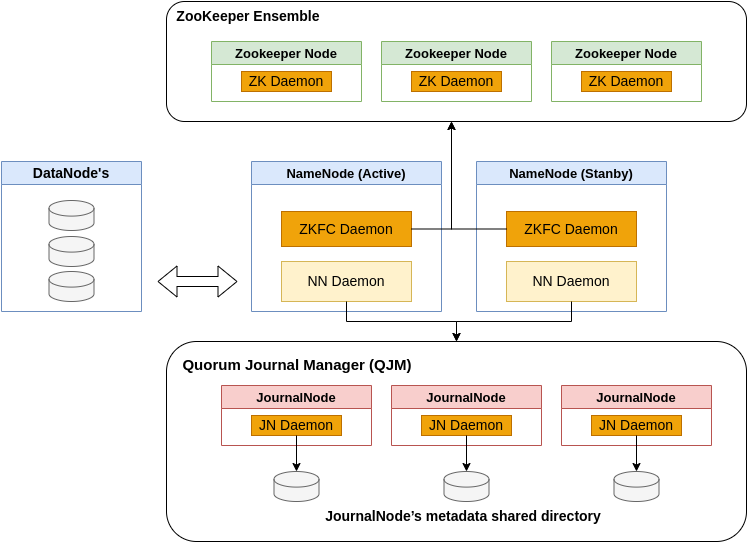

## Apache Hadoop

Apache Hadoop is a collection of open-source software utilities that facilitates 
using a network of many computers to solve problems involving massive amounts of 
data and computation.

The base Apache Hadoop framework is composed of the following modules:

* **Hadoop Common**: Contains libraries and utilities needed by other Hadoop modules.
* **Hadoop Distributed File System (HDFS)**: A distributed file-system that stores 
  data on commodity machines, providing very high aggregate bandwidth across the cluster.
* **Hadoop YARN**: A platform responsible for managing computing resources in clusters 
  and using them for scheduling users' applications.
* **Hadoop MapReduce**: An implementation of the MapReduce programming model for large-scale 
  data processing.
* **Hadoop Ozone**: An object store for Hadoop.

## Hadoop HDFS

An HDFS cluster has two types of nodes operating in a master−worker pattern: A
namenode (the master) and a number of datanodes (workers).

### The namenode manages the filesystem namespace 
It maintains the filesystem tree and the metadata for all the files and directories 
in the tree. This information is stored persistently on the local disk in the form 
of two files: **the namespace image** and **the edit log**. The namenode also knows the 
datanodes on which all the blocks for a given file are located; however, it does 
not store block locations persistently, because this information is reconstructed 
from datanodes when the system starts.

### Datanodes are the workhorses of the filesystem 

They store and retrieve blocks when
they are told to (by clients or the namenode), and they report back to the namenode
periodically with lists of blocks that they are storing.

### HDFS Resilence

Without the namenode, the filesystem cannot be used. In fact, if the machine running
the namenode were obliterated, all the files on the filesystem would be lost since there
would be no way of knowing how to reconstruct the files from the blocks on the
datanodes. For this reason, it is important to make the namenode resilient to failure,
and Hadoop provides two mechanisms for this.

1. The first way is to back up the files that make up the persistent state of the filesystem
metadata. Hadoop can be configured so that the namenode writes its persistent state to
multiple filesystems. These writes are synchronous and atomic. The usual configuration
choice is to write to local disk as well as a remote NFS mount.

2. It is also possible to run a secondary namenode (cool standby namenode), which 
despite its name does not act as a namenode. Its main role is to periodically merge 
the namespace image with the edit log to prevent the edit log from becoming too large. 
The secondary namenode usually runs on a separate physical machine because it requires 
plenty of CPU and as much memory as the namenode to perform the merge. It keeps a 
copy of the merged name space image, which can be used in the event of the namenode 
failing. However, the state of the secondary namenode lags that of the primary (non
in-sync), so in the event of total failure of the primary, data loss is almost certain. 
The usual course of action in this case is to copy the namenode’s metadata files that 
are on NFS to the secondary and run it as the new primary.

### HDFS HA

The combination of replicating namenode metadata on multiple filesystems and using
the secondary namenode to create checkpoints protects against data loss, but it does
not provide high availability of the filesystem. The namenode is still a single point of
failure (SPOF). If it did fail, all clients—including MapReduce jobs—would be unable
to read, write, or list files, because the namenode is the sole repository of the metadata
and the file-to-block mapping. In such an event, the whole Hadoop system would effectively 
be out of service until a new namenode could be brought online.

Hadoop remedied this situation by adding support for HDFS high availability (HA).
In this implementation, there are a pair of namenodes in an active-standby configuration. 
In the event of the failure of the active namenode, the standby takes over its duties
to continue servicing client requests without a significant interruption. A few 
architectural changes are needed to allow this to happen:

* The namenodes must use highly available shared storage to share the edit log. When
a standby namenode comes up, it reads up to the end of the shared edit log to
synchronize its state with the active namenode, and then continues to read new
entries as they are written by the active namenode.
* Datanodes must send block reports to both namenodes because the block mappings
are stored in a namenode’s memory, and not on disk.
* Clients must be configured to handle namenode failover, using a mechanism that
is transparent to users.
* The secondary namenode’s role is subsumed by the standby, which takes periodic
checkpoints of the active namenode’s namespace.

There are two choices for the highly available shared storage: 

1. A shared NFS directory to share edit logs between the Active and Standby NameNodes.
2. A Quorum Journal Manager instead of NFS share.

### HDFS HA with Quorum Journal Manager - QJM

The QJM is a dedicated HDFS implementation, designed for
the sole purpose of providing a highly available edit log, and is the recommended choice
for most HDFS installations. The QJM runs as a group of journal nodes, and each edit
must be written to a majority of the journal nodes. Typically, there are three journal
nodes, so the system can tolerate the loss of one of them. This arrangement is similar
to the way ZooKeeper works, although it is important to realize that the QJM imple‐
mentation does not use ZooKeeper. (Note, however, that HDFS HA do does use ZooKeeper
for electing the active namenode).

If the active namenode fails, the standby can take over very quickly (in a few tens of
seconds) because it has the latest state available in memory: both the latest edit log entries
and an up-to-date block mapping. The actual observed failover time will be longer in
practice (around a minute or so), because the system needs to be conservative in de‐
ciding that the active namenode has failed.

Journal nodes are distributed system to store edits. Active Namenode as a client 
writes edits to journal nodes and commit only when its replicated to all the journal 
nodes in a distributed system. Standby NN need to read data from edits to be in sync 
with Active one. It can read from any of the replica stored on journal nodes.

### From Standby to Active NN

The transition from the active namenode to the standby is managed by a new entity in
the system called the failover controller. There are various failover controllers, but the
default implementation uses ZooKeeper to ensure that only one namenode is active.
Each namenode runs a lightweight failover controller process whose job it is to monitor
its namenode for failures (using a simple heartbeating mechanism) and trigger a failover
should a namenode fail.

The ZKFailoverController (ZKFC) is a component which is a ZooKeeper client which 
also monitors and manages the state of the NameNode. Each of the machines which 
runs a NameNode also runs a ZKFC, and that ZKFC is responsible for:

1. Health monitoring - the ZKFC pings its local NameNode on a periodic basis with 
a health-check command. So long as the NameNode responds in a timely fashion with 
a healthy status, the ZKFC considers the node healthy. If the node has crashed, 
frozen, or otherwise entered an unhealthy state, the health monitor will mark it as unhealthy.

2. ZooKeeper session management - when the local NameNode is healthy, the ZKFC 
holds a session open in ZooKeeper. If the local NameNode is active, it also holds 
a special “lock” znode. This lock uses ZooKeeper’s support for “ephemeral” nodes; 
if the session expires, the lock node will be automatically deleted.

3. ZooKeeper-based election - if the local NameNode is healthy, and the ZKFC sees 
that no other node currently holds the lock znode, it will itself try to acquire 
the lock. If it succeeds, then it has “won the election”, and is responsible for 
running a failover to make its local NameNode active. The failover process is similar 
to the manual failover described above: first, the previous active is fenced if 
necessary, and then the local NameNode transitions to active state.

## HDFS HA Big Picture (daemons and nodes)

## Kubernetes Hadoop Peculiarities

