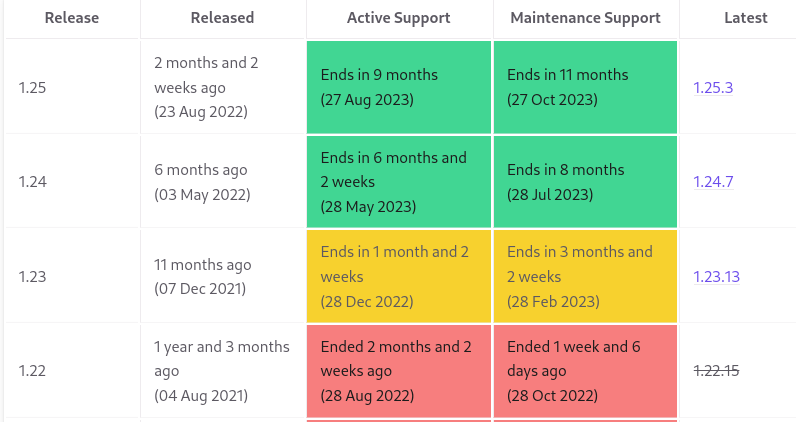
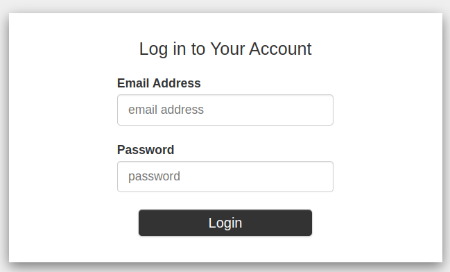
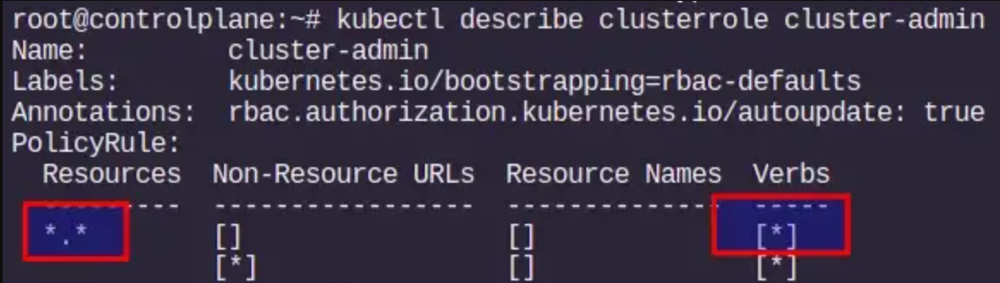

## Important Note

This document is based on Kubeflow 1.6, the current stable release at the time of writing this document.

It's important notice that the Kubernetes version supported by Kubeflow 1.6 is: Kubernetes 1.22.x

Unfortunately this Kubernetes version is deprecated, more information [here](https://endoflife.date/kubernetes)



## Introduction

Machine learning development or model development essentially follows the path: data -> information 
-> knowledge -> insight. Model development life cycle (MDLC) is a term commonly used to describe the flow
between training and inference.

Kubeflow is a collection of cloud native tools for all of the stages of MDLC (data
exploration, feature preparation, model training/tuning, model serving, model testing, 
and model versioning). Kubeflow also has tooling that allows these traditionally
separate tools to work seamlessly together. An important part of this tooling is the
pipeline system, which allows users to build integrated end-to-end pipelines that con‐
nect all components of their MDLC.

The Kubeflow project was first announced at **KubeCon + CloudNativeCon North America 2017**
by Google engineers David Aronchick, Jeremy Lewi, and Vishnu Kannan.

Kubeflow started as an open sourcing of the way Google ran TensorFlow internally, 
based on a pipeline called **TensorFlow Extended (TFX)**. It began as just a simpler 
way to run TensorFlow jobs on Kubernetes, but has since expanded to be a multi-architecture, 
multi-cloud framework for running end-to-end machine learning workflows.

## Installation 

In this section we are going to install Kubeflow by means of Kubernetes manifests,
this installation procedure is considered an advanced method.

The best approach for using persistence in Kubeflow is make available any kind of
dynamic provisioning. For example with can use for simplicity the NFS subdir external 
provisioner. For make available automatically for Kubeflow, we have to setup this
provisioner as the **default** providioner:

```
kubectl patch storageclass nfs-client -p '{"metadata": {"annotations":{"storageclass.kubernetes.io/is-default-class":"true"}}}'                   
```

Just in case we have tried install Kubeflow and the default provisioner is not configured
in our cluster, we will have to modified manually the persistence of Kubeflow with the following
commans:

```
kubectl get pvc/authservice-pvc -n istio-system -o yaml > authservice-pvc.yaml
kubectl get pvc/katib-mysql -n kubeflow -o yaml > katib-mysql.yaml
kubectl get pvc/minio-pvc -n kubeflow -o yaml > minio-pvc.yaml
kubectl get pvc/mysql-pv-claim -n kubeflow -o yaml > mysql-pv-claim.yaml
```
We have to edit the PVC, for example:

```
apiVersion: v1
kind: PersistentVolumeClaim
metadata:
  name: mysql-pv-claim
spec:
  accessModes:
  - ReadWriteOnce
  resources:
    requests:
      storage: 20Gi
  storageClassName: nfs-client <======= 
```

The following the installation itself using the manifests and Kustomize tool:

```
git clone https://github.com/kubeflow/manifests.git
git checkout tags/v1.6.1 -b v1.6.1
cd manifests
while ! kustomize build example | kubectl apply -f -; do echo "Retrying to apply resources"; sleep 10; done
```
The kustomize command will raise errors because of un-ordered manifest application, however finally
with some retry the Kubeflow system will be installed successfuly.

### Port-Forward

The default way of accessing Kubeflow is via port-forward. This enables you to get started quickly without imposing any requirements on your environment. Run the following to port-forward Istio's Ingress-Gateway to local port `8080`:

```sh
kubectl port-forward svc/istio-ingressgateway -n istio-system 8080:80
```

After running the command, you can access the Kubeflow Central Dashboard by doing the following:

1. Open your browser and visit `http://localhost:8080`. You should get the Dex login screen.
2. Login with the default user's credential. The default email address is `user@example.com` and the default password is `12341234`.

## Add users (static password)

We will have by default this user email (`user@example.com`) and password (`12341234`).

To access the **Kubeflow Central Dashboard**, you need to connect to the Istio gateway that provides access 
to the Kubeflow service mesh.

The endpoint by default for logging in is:

```
k get svc -n istio-system | grep NodePort
istio-ingressgateway    NodePort    10.99.109.239   <none>        15021:30585/TCP,80:32223/TCP,443:30541/TCP,31400:31880/TCP,15443:31005/TCP
```

http://worker-node-ip:32223



An administrator can manually create a profile for any user in the Kubeflow cluster. 
Here an administrator is a person who has **cluster-admin role binding** in the Kubernetes cluster. 
This person has permissions to create and modify Kubernetes resources in the cluster. 
For example, the person who deployed Kubeflow will have administration privileges in the cluster.

Note: For checking the cluster-admin role for the current user

```
kubectl describe clusterrole cluster-admin
```




Adding a new user into Kubeflow is adding a new Profile (a dedicated NameSpace for this
new user):

### Step 1: Create a new profile

```
cat add-new-profile-kubeflow.yaml

apiVersion: kubeflow.org/v1beta1
kind: Profile
metadata:
  name: kubeflow-ns01
spec:
  owner:
    kind: User
    name: superuser@example.com

k apply -f profile-kubeflow.yaml
```

### Step 2: Add new static user and password

```
k get cm dex -n auth -o jsonpath='{.data.config\.yaml}' > dex.yaml

vim dex.yaml 
[---]
staticPasswords:
- email: user@example.com
  hash: $2y$12$4K/VkmDd1q1Orb3xAt82zu8gk7Ad6ReFR4LCP9UeYE90NLiN9Df72
  # https://github.com/dexidp/dex/pull/1601/commits
  # FIXME: Use hashFromEnv instead
  username: user
  userID: "15841185641784"
- email: superuser@example.com
  hash: $2y$12$4K/VkmDd1q1Orb3xAt82zu8gk7Ad6ReFR4LCP9UeYE90NLiN9Df72
  # https://github.com/dexidp/dex/pull/1601/commits
  # FIXME: Use hashFromEnv instead
  #hashFromEnv: "SUPERUSER_PASSWORD"
  username: superuser
[---]

k create cm dex --from-file=config.yaml=dex.yaml -n auth --dry-run=client -o yaml | kubectl apply -f -
k rollout restart deployment dex -n auth
```

Note: https://bcrypt-generator.com/ 


## Setting Up Your Kubeflow Development Environment

Setup a Kubeflow development environment is to setup Kubeflow Pipelines environment.

Kubeflow Pipelines is a platform for building and deploying portable, scalable machine learning (ML) 
workflows based on containers. 

The Kubeflow Pipelines platform consists of:

* A user interface (UI) for managing and tracking experiments, jobs, and runs.
* An engine for scheduling multi-step ML workflows.
* An SDK for defining and manipulating pipelines and components.
* Notebooks for interacting with the system using the SDK.

In particular a pipeline is a description of a machine learning (ML) workflow, 
including all of the components in the workflow and how the components relate to each 
other in the form of a graph. The pipeline configuration includes the definition of the 
inputs (parameters) required to run the pipeline and the inputs and outputs of each component.

When you run a pipeline, the system launches one or more Kubernetes Pods corresponding to the 
steps (components) in your workflow (pipeline). The Pods start containers, and the containers in 
turn start your programs.

After developing your pipeline, you can upload your pipeline using the Kubeflow Pipelines UI or the 
Kubeflow Pipelines SDK.

### Kubeflow Pipelines SDK

The Kubeflow Pipelines SDK provides a set of Python packages that you can use to specify and run 
your machine learning (ML) workflows. 

So Kubeflow’s pipeline system is built in Python, and having the SDK installed locally
will allow you to build pipelines faster. However, if you can’t install software locally,
you can still use Kubeflow’s Jupyter environment to build your pipelines.

### Kubeflow Pipelines CLI tool 

```
conda create -n kfenv python=3
conda env list
conda activate kfenv
(kfenv) pip install kfp
(kfenv) kfp
(kfenv) conda deactivate
```
