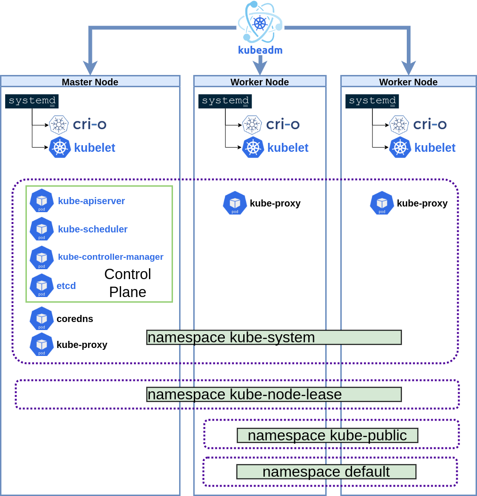
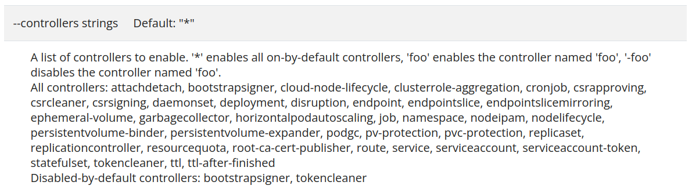

## Introduction

The concept of Kubernetes Operators was introduced in a [blog post](https://cloud.redhat.com/blog/introducing-operators-putting-operational-knowledge-into-software?extIdCarryOver=true&sc_cid=7013a0000034XKLAA2) 
in 2016 by CoreOS. CoreOS created their own container-native Linux operating system that was optimized
for the needs of cloud architecture. Red Hat acquired the company in 2018.

The principal idea behind an Operator is to automate cluster and application management
tasks that would normally be done manually by a human. This role can be thought of as an
automated extension of support engineers or development-operations (DevOps) teams.

Bilgin Ibryam classified in his book Kubernetes Patterns, a bunch of patterns for 
applying in kubernetes development:

* Foundational patterns
* Behavior patterns 
* Structural patterns
* Configuration patterns
* Advanced patterns

Within the advanced patterns the author classified the Operator Pattern. According to the author: “An Operator is a Controller that uses a CRD to encapsulate operational knowledge for a specific application in an algorithmic and automated form. The Operator pattern allows us to extend the Controller pattern from the preceding chapter for more flexibility and greater expressiveness”

Let’s go step by step!

## Kube Controller Manager

Let's take a look to the core components of a Kubernetes cluster. The archiecture
of Kubernetes can be simplified in the follwing structural items (taking into account
the Kubeadm vanilla Kubernetes approach):

* **Control Plane**
  * API Server: Control Plane Frontend, this is the main server of a cluster.
  * **Controller Manager**: Cluster state management (plenty of different controllers within).
  * Scheduler: Pod to node placement management.
  * Etcd store: k8s data store (object store). High availability key value (KV) store.
* **Aplication Plane, or Data Plane**
  * Kube Proxy: Network rules for each node. Monitor new services for creating the rules for getting access from the external node perspective to the service.
  * CoreDNS: Service discovery add-on.
  * CRI daemon: Such as CRI-O, Containerd, ..., a container runtime interface (engine).
  * kubelet daemon: This is the captain of the node, watch for the state of its node watching the API Server.

  The core component for our Operators it's the **Kubernetes Controller Manager**: *The Kubernetes controller 
  manager is a daemon that embeds the core control loops shipped with Kubernetes. In applications of 
  robotics and automation, a control loop is a non-terminating loop that regulates the state of the 
  system. In Kubernetes, a controller is a control loop that watches the shared state of the cluster 
  through the apiserver and makes changes attempting to move the current state towards the desired state.*

Here a picture of the Kubeadm approach with all of these components:

<p align="center">

</p>

You can inspect the built-in controllers enabled in a Kubernetes cluster with the
following parameter in ```kube-controller-manager [flags]``` (by default all the 
built-in controllers are enabled):

<p align="center">

</p>

> That's said, to create a Operator is to extend the Controller Manager with our custom 
controller!

## Semantic definition of an operator

So technically explained what is an Operator, here a definition from a semantic perspective:

> Operator = Kubernetes Resource + Kubernetes Controller + Knowledge

* Kubernetes Resource:  Pod, Route, ConfigMap, etc.
* Kubernetes Controller: DaemonSet, Deployment, Job, etc.
* Knowledge: Scale, Clean Up, Backup, Update, Self Health, etc.

So the idea is to transfer the knowledge of a human operator (a system administrator), 
knowledge of how a particular technology is managed, to a software component, so that 
the technology can be managed in a standard and simple way by administrators or Kubernetes 
users. We can say that an Operator adds a level of abstraction to the complexity of managing 
a particular technology. It is important to say that the creation of Operators is closely 
linked to the creation of statefull technologies due to their greater complexity, although 
the market is tending to create operators for almost all technologies.

## Terminology

* **Operand**: The managed workload provided by the Operator as a service. An Operand is any kind
of application or workload whose state is reconciled by an Operator. Operators can have
many Operands, though most Operators usually just one.

* **Custom Resource (CR)**: An instance of the CustomResourceDefinition the Operator ships 
that represents the Operand or an Operation on an Operand (also known as primary resources).
An operator must provide a way for cluster administrators to interact with it and configure 
settings for their application. An Operator exposes its configuration options through a Custom Resource.

* **Custom Resource Definition (CRD)**: An API of the Operator, providing the blueprint and validation 
rules for Custom Resources. CRDs are themselves a type of native Kubernetes object that allows users 
and administrators to extend the Kubernetes platform with their own resource objects beyond what is 
defined in the core API.

* **Managed resources** - the Kubernetes objects or off-cluster services the Operator uses to constitute 
an Operand (also known as secondary resources). For example an Operator deploys a database by creating 
a Deployment, ServiceAccount, RoleBinding, ConfigMap, PersistentVolumeClaim and Secret object, those are
managed resources managed by the Operator.

## Operator Framework Installation

[Operator Framework SDK Installation](../documentation/operators.md)

