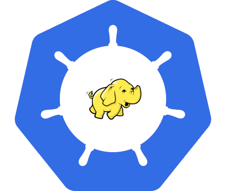

# Big Data on Kubernetes

Community resource for big data and data science related software projects on 
techniques and best practices for integrating with Kubernetes.

This group is different from Kubernetes Big Data User Group because, unlike 
Kubernetes User Groups where though their central goal is not a deliverable 
piece of work, one of the objectives of this project is to create user-ready 
deliverables and software tools.

